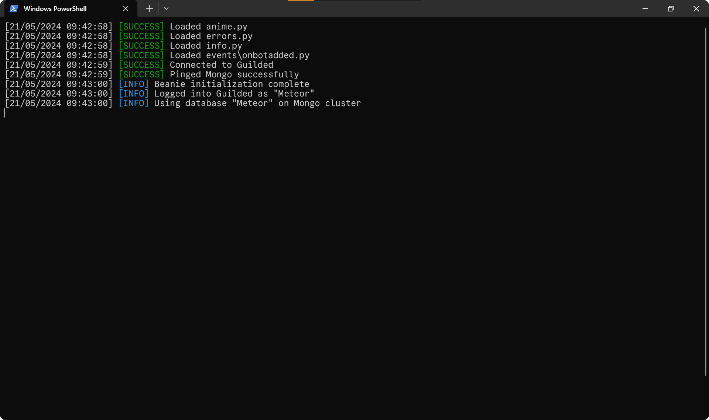

    

 

# `✨` Meteor
Meteor is a free and open source Guilded bot made for any community.

 

# `💠` Commands
- Anime.
- - Top anime.
- - Random anime.
- - Anime searching.

 
 
# `📃` Features
- Speedy responses.
- Powerful error handling.
- Easy to use commands.

# `🔨` How to run
> [!NOTE]
> We assume that you've already downloaded the code and installed dependencies.

1. Start by filling out the `config.yaml` file with all the necessary information.
2. Next, execute the command `python main.py` in your terminal.
3. If everything is set up correctly, your console output should resemble the following:

    

4. If you encounter any issues, double-check your configuration and ensure that all dependencies are properly installed.